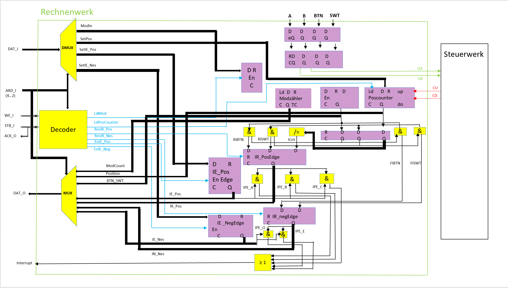
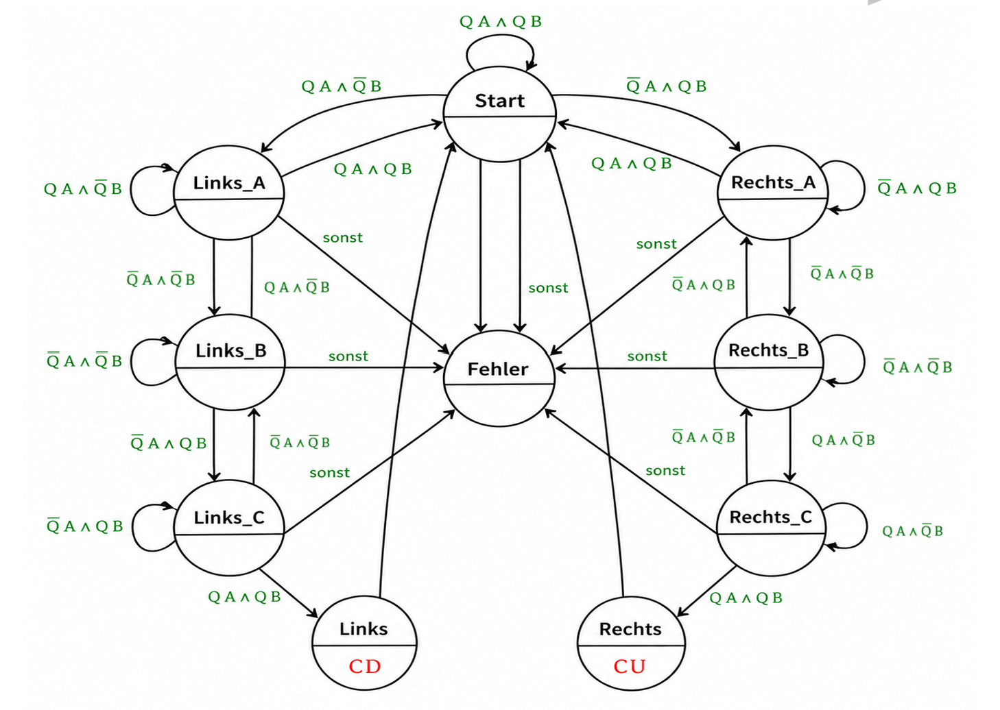
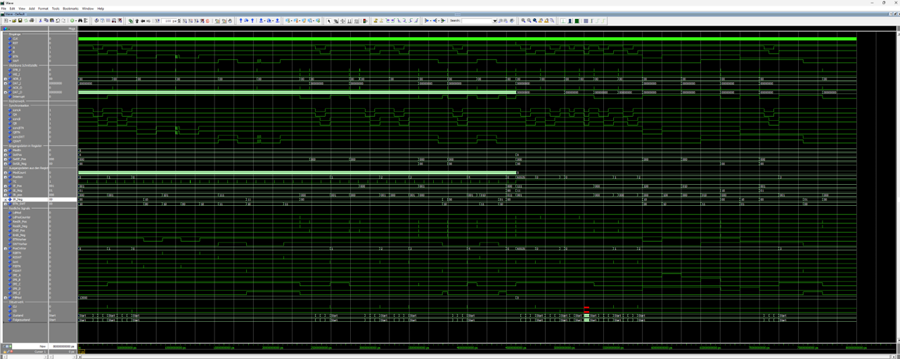

# FPGA PmodENC Interface

## Overview

This project was developed as part of the course **Digitale Komponenten** at Hochschule Osnabrück.

The aim of the project was to develop an FPGA-based interface for the **Digilent PmodENC rotary encoder**. The system evaluates the encoder signals to determine the direction of rotation and position. It also processes the push button and switch signals.

The project includes synchronization, debouncing, polling and interrupt functionality as well as communication via a Wishbone bus interface.

## Main Functions

- Detection of clockwise and counter-clockwise rotation
- Position counting
- Processing of push button and switch signals
- Input synchronization
- Signal debouncing
- Polling functionality
- Interrupt functionality
- Wishbone bus interface
- Verification using simulation and FPGA hardware

## System Concept

The PmodENC provides two encoder signals, **A** and **B**.

The phase relationship between these two signals is evaluated to determine the direction of rotation.

### Clockwise Rotation

`11 → 01 → 00 → 10 → 11`

### Counter-clockwise Rotation

`11 → 10 → 00 → 01 → 11`

## Block Diagram

The block diagram shows the main functional structure of the system and the signal flow between the PmodENC and the FPGA component.

## State Machine

A state-machine-based concept is used to evaluate the encoder signals and determine the direction of rotation.

## Register Interface

The component provides registers for:

- Debouncing configuration
- Position
- Positive interrupt enable
- Negative interrupt enable
- Positive interrupt request
- Negative interrupt request
- Button and switch status

## Verification

The functionality of the system was tested using a VHDL testbench and FPGA hardware.

The tests included:

- Clockwise rotation
- Counter-clockwise rotation
- Position increment and decrement
- Push button behavior
- Switch behavior
- Debouncing
- Positive and negative interrupt functionality
- Read-to-clear interrupt behavior

## My Contribution

The project was developed in a team of two students.

My contribution focused mainly on:

- Analysis of the PmodENC functionality
- Development and documentation of the system concept
- Preparation of technical diagrams
- Documentation of the functional behavior
- Support in testing and verification
- Preparation of the project report and presentation

The main VHDL implementation was primarily developed by my project partner.

## Technologies

- FPGA
- VHDL
- Digilent PmodENC
- Wishbone Bus
- Testbench / Simulation

## Project Context

University project  
Course: **Digitale Komponenten**  
Hochschule Osnabrück

## Note

The source code is not included in this repository.

This repository is intended as a technical documentation and portfolio overview of the project.
